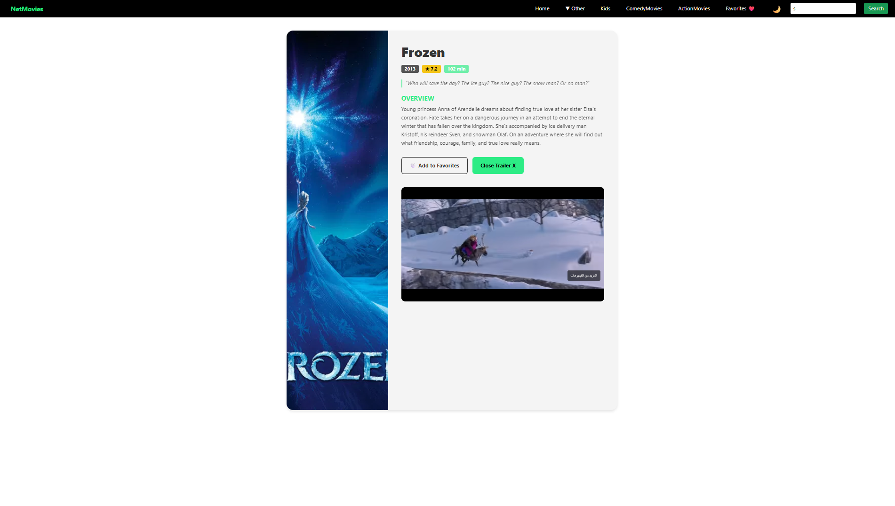
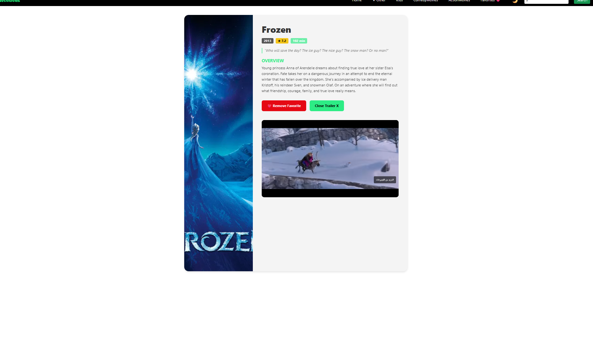

# 🎬 MovieBrowser React App

> A fully functional movie discovery web application built with **React**, **React Router**, and the **TMDB API**.


This app allows users to explore trending movies, browse by genre, search for titles in real-time, and save their favorites using a global state management system.

## 🔗 Live Demo
### [👉 Click here to view the Live Demo](ضع_رابط_Vercel_هنا)

---

## 📸 Screenshots

| Login / Home | Movie Details |
|:---:|:---:|
|  |  |
|  |  |
|  |  |
|  |  |
|  |  |

> *Note: Make sure the file names in the code above match exactly the names inside your folder.*
---

## 🚀 Features

### 🔍 Discovery & Search
- **Real-Time Search:** Search for any movie using the TMDB database directly from the Navbar.
- **Dynamic Categories:** Dedicated pages to explore content:
  - **Trending & Now Playing:** Stay up to date with the latest hits.
  - **Upcoming & Top Rated:** See what’s coming soon and what’s highly recommended.

### 📂 Organization & Filters
- **Genres:** Filter movies by specific categories like **Action**, **Comedy**, and **Kids**.
- **TV Shows:** A dedicated section to browse popular television series.

### ❤️ User Experience
- **Global Favorites:** A robust "Favorites" system powered by **React Context API** to save movies across different sessions.
- **Responsive Design:** Fully styled with **Bootstrap 5** to ensure it looks great on Mobile, Tablet, and Desktop.

---

## 🛠️ Tech Stack

- **Frontend:** React.js (Hooks, Functional Components)
- **Routing:** React Router DOM v6
- **State Management:** Context API (GlobalProvider & AppReducer)
- **Styling:** Bootstrap 5 & Custom CSS
- **Data Source:** [The Movie Database (TMDB) API](https://www.themoviedb.org/)

---

## 📂 Project Structure

Here is an overview of the project's file structure:

```bash
src/
├── components/
│   ├── Navbar.js         # Navigation bar with Search
│   ├── MovieCard.js      # Reusable card component
│   └── MovieControls.js  # Add/Remove buttons
├── context/
│   ├── GlobalContext.js  # State Provider
│   └── AppReducer.js     # Reducer for Favorites logic
├── pages/
│   ├── Home.js           # Main landing page
│   ├── Trending.js       # Trending Movies
│   ├── TVShows.js        # TV Series Section
│   ├── Genres.js         # Filter by Genre
│   └── Watchlist.js      # User's Favorites Page
├── App.js                # Main Routing Logic
├── App.css               # Custom Styles
└── index.js